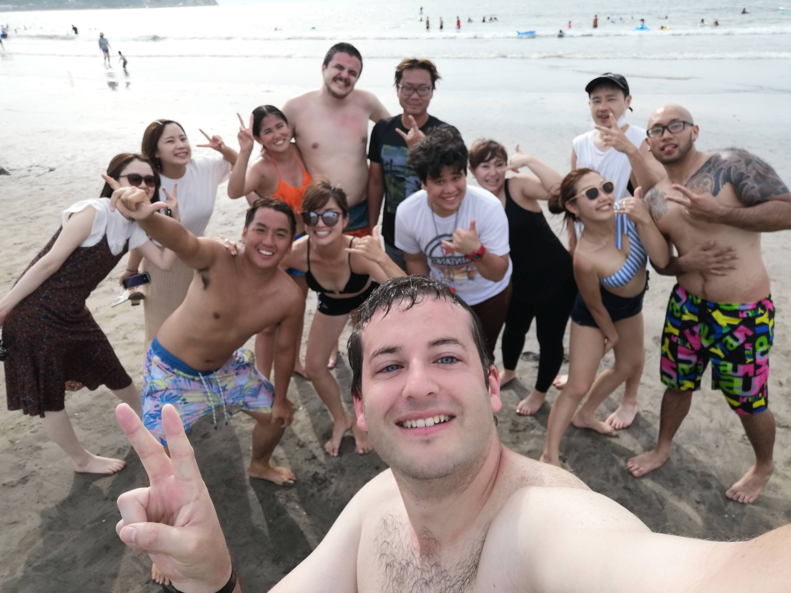

Hello everyone! I have just about finished my summer vacation.

On Monday, I went with my friend Scott and a group of people to
Kamakura Zaimokuza Beach. We rented out a space on the beach front,
and barbecued and hung out all day. It was a lot of fun.
Here is a picture I took of our whole group:

From there, I left to go to home to prepare to take the night bus to Kyoto,
but due to both of our (but mostly my) negligence, we ended up barely missing
the night bus. We halfheartedly made an attempt to try to find another bus
leaving afterward, but the websites are not well-designed and we decided not
to try to take the bus.

I am still struggling to get images to be embedded in these posts, but I'll
update this post later once I figure out how to do it again. Some of the
highlights of the trip were catching up with a friend Joey that I met at
Yahoo Lodge, getting a ton of exercise by hiking both Daimonjiyama and most
of Mount Atago in the same day, and spending time out in deep nature away from everything.